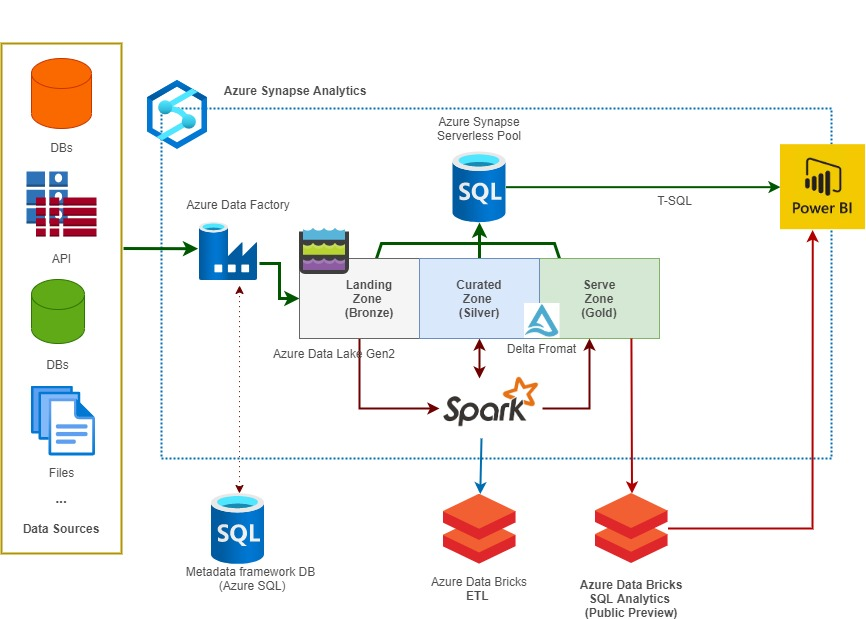
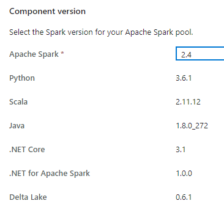

# Data lakehouse in practice

## Synapse Spark vs Databricks

https://www.element61.be/en/resource/when-use-azure-synapse-analytics-andor-azure-databricks

**Pros**

- Shared HIVE Metastore 

  [Demo 1]: (Demo001-Synapse.md)

**Cons**

- Spark 2.4 (Delta 0.6)

- **Spark SQL MERGE/DELETE/CREATE TABLE statements are not supported in Synapse - only Scale/Python syntax is available.**
- OPTIMIZE functionality isn’t available 

