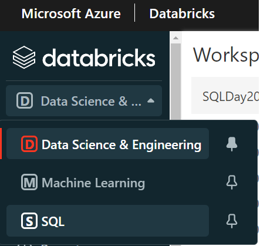

# SQL Day 2022 Demo SQL Endpoit

#### Open Databricks workspace SQL Workspace

##### Enable **Web Terminal**



#### Sample Query

```sql
SELECT p.Name AS ProductName,SUM(f.OrderQty) AS TotalSald, SUM(f.OrderQty * f.UnitPrice) AS TotalValue
FROM dwhdltdemo.FactSalesOrderdetail AS f
JOIN dwhdltdemo.DimProduct AS p ON p.ProductID = f.ProductID
GROUP BY p.Name
ORDER BY TotalValue DESC;

```


