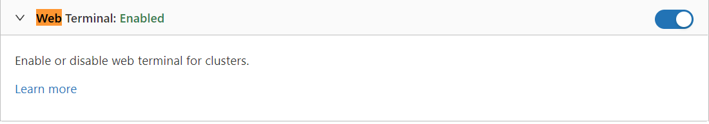
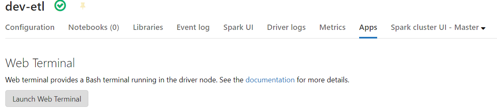

# SQL Day 2022 Demo Metastore

#### Open Databricks workspace ->Admin Console -> Workspace settings

##### Enable **Web Terminal**



#### Lunch Web Terminal (Compute->Cluster->Apps->Lunch Web Terminal)



##### Open hive config

```shell
cat /databricks/hive/conf/hive-site.xml
```

##### Extract connection details

##### Connect via DBeaver (MariaDB)

Enable: Use SSQL	

Disable: SSL verify server certificate