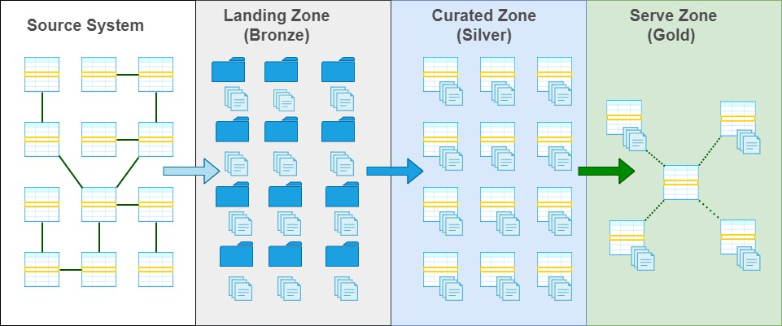

# Data analytics solutions

## Source System

- Relational data bases 
- Flat files
- API (REST)

## Landing Zone (Bronze)

- EL Process 
  - Metadata framework -Azure Data Factory/Synapse Integration Pipelines
  - Data partitioning 
- Data format
  - **Parquet** , Native (Json, Avro, Csv)

## Curated Zone (Silver)

- ETL Process
  - Metadata framework -Spark Databricks
  - **Slowly Changing Dimensions Type 2**
- Data format 
  - **Delta** (Spark Tables -> One to One : Source System -> Curated Zone )
- Serving Layer
  - **Azure Synapse Serverless (Views on Delta)**
  - Azure Data Bricks SQL Analytics (Table)

## Golden Zone (Silver)

- ETL Process
  - Metadata framework -Spark Databricks
  - **Data Model (Kimball)**
- Data format 
  - **Delta** (Spark Tables -Data Model )
- Serving Layer
  - **Azure Synapse Serverless (Views on Delta)**
  - Azure Data Bricks SQL Analytics (Table)