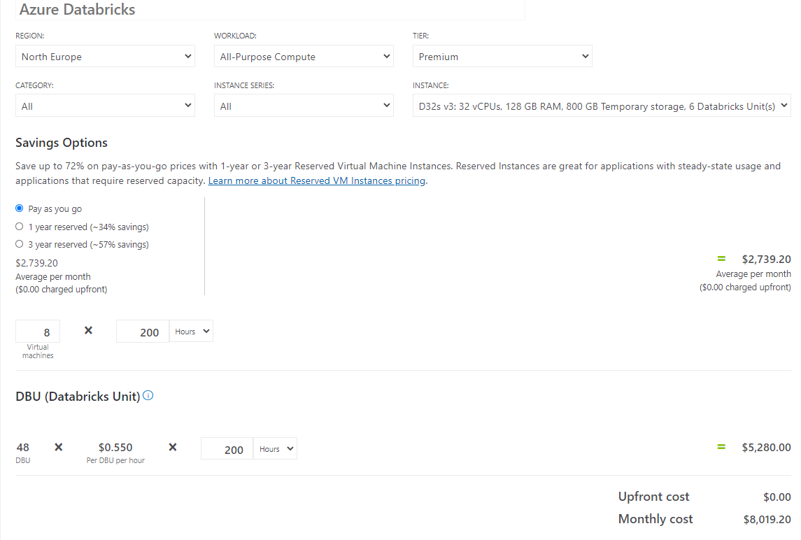
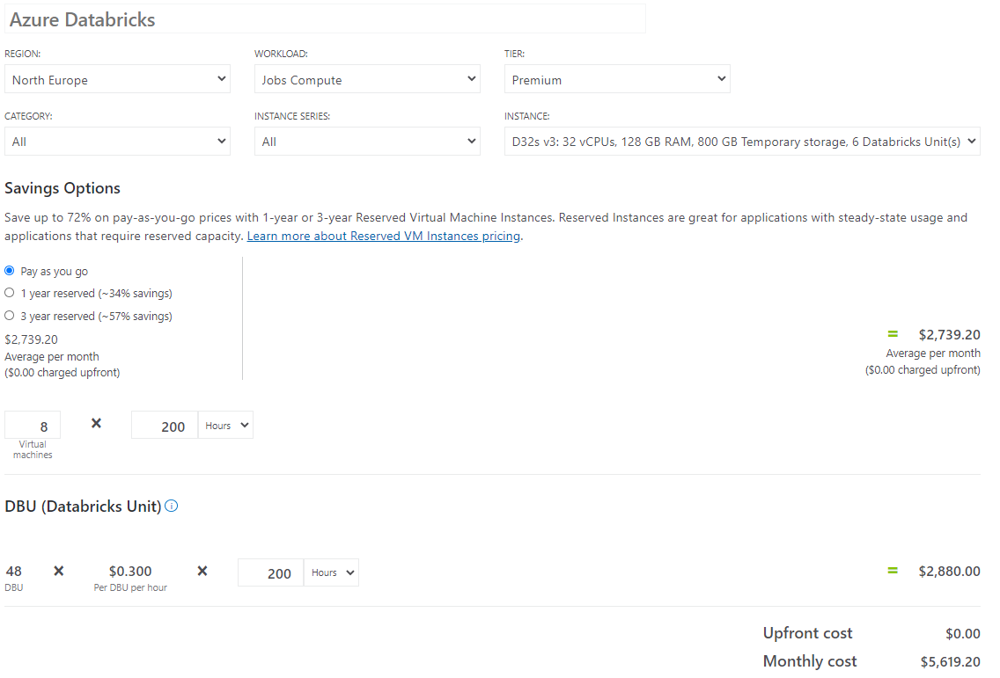

# Databricks Clusters

- You can create an *all-purpose cluster* using the UI, CLI, or REST API. You can manually terminate and restart an all-purpose cluster. Multiple users can share such clusters to do collaborative interactive analysis.
- The Azure Databricks job scheduler creates *a job cluster* when you run a [job](https://docs.microsoft.com/en-us/azure/databricks/jobs) on a *new job cluster* and terminates the cluster when the job is complete. You *cannot* restart a job cluster.

https://docs.microsoft.com/en-us/azure/databricks/clusters/

## Job Cluster

