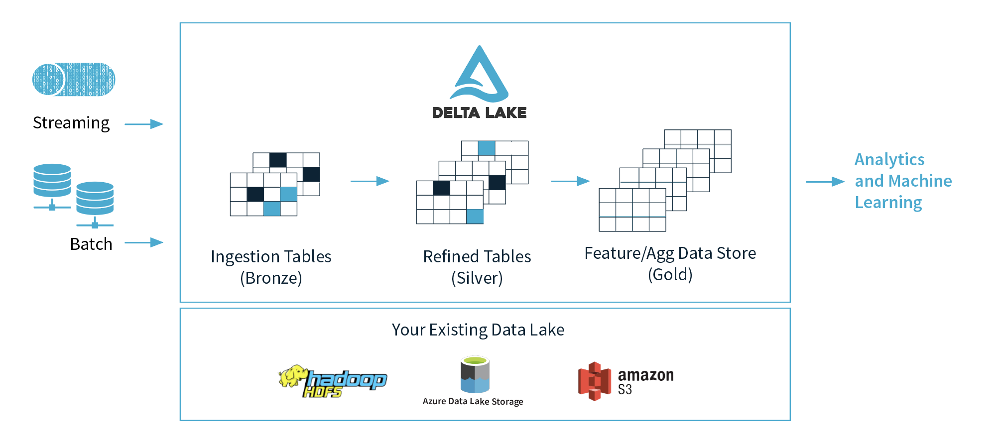

# Data Lakehouse approach

**A lakehouse is a new DM paradigm that enables users to do everything from BI, SQL analytics, data science, and ML on a single platform.**  

**The data warehouse approach isn’t future-proof because it’s missing support for predictions,
real-time (streaming) data, flexible scalability, and managing raw data in any format**  

https://databricks.com/wp-content/uploads/2020/12/cidr_lakehouse.pdf#:~:text=Lakehouse:%20A%20New%20Generation%20of%20Open%20Platforms%20that,designed,%20which%20could%20be%20eliminated%20with%20a%20Lakehouse.

https://www.snowflake.com/guides/what-data-lakehouse

## Delta Lake

Delta Lake is an open-source storage layer that brings  ACID transactions to Apache Spark and big data workloads.

https://delta.io/

## Why Lakehouse

### Enables a single combined cloud data platform: 

With a lakehouse, all data is kept within its lake format; it’s a common storage medium across the whole architecture  

### Unifies data warehousing and machine learning (ML)  

One platform for data warehousing and ML supports all types and frequency of data  

### Increases data team efficiency  

Lakehouses are enabled by a new system design that implements similar data structures and data management features to those in a data warehouse, directly on the kind of low-cost storage used for data lakes.
Merging them into a single system means that ML teams can move faster because they’re able to use data without needing
to access multiple systems  

### Reduces cost  

With the lakehouse approach, you have one system for data warehousing and ML. Multiple systems for different analytics use cases are eliminated. You can store data in cheap object storage such as Amazon S3, Azure Blob Storage, and so on.

### Simplifies data governance    

A lakehouse can eliminate the operational overhead of managing data governance on multiple tools.  

### Simplifies ETL jobs  

With the data warehousing technique, the data has to be loaded into the data warehouse to query or to perform analysis. But by using the lakehouse approach, the ETL process is eliminated by connecting the query engine directly to your data lake  

### Removes data redundancy  

The lakehouse approach removes data redundancy by using a single tool to process your raw data. Data redundancy happens when you have data on multiple tools and platforms such as cleaned data on data warehouse for processing, some meta-data on
business intelligence (BI) tools, and temporary data on ETL tools.  

### Enables direct data access  

Data teams can use a query engine to query the data directly from raw data, giving them the power to build their transformation logics and cleaning techniques after understanding basic statistical insights and quality of the raw data.

### Connects directly to BI tools    

Lakehouses enables tools, such as Apache Drill and supports the direct connection to popular BI tools like Tableau, PowerBI, and so on.  

### Handles security

Data related security challenges are easier to handle with a simplified data flow and single source of truth approach. 

  